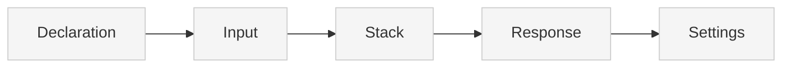

> ## Documentation Index
> Fetch the complete documentation index at: https://docs.xano.com/llms.txt
> Use this file to discover all available pages before exploring further.

# XanoScript for APIs

> Define APIs in XanoScript to build RESTful API endpoints

export const xanoscriptApiInputsDiagram = `
\`\`\`mermaid
flowchart TB
    A[Declaration] --> B[Input]
    B --> C[Stack]
    C --> D[Response]
    D --> E[Settings]
    style A fill:#cdeaff,stroke:#0077cc,stroke-width:2px
    style B fill:#f5f5f5,stroke:#ccc,stroke-width:1px
    style C fill:#f5f5f5,stroke:#ccc,stroke-width:1px
    style D fill:#f5f5f5,stroke:#ccc,stroke-width:1px
    style E fill:#f5f5f5,stroke:#ccc,stroke-width:1px
\`\`\`
`;

export function SideBySide({diagram, children}) {
  return <div style={{
    display: "flex",
    gap: "1rem",
    alignItems: "flex-start",
    flexWrap: "wrap"
  }}>
      <div style={{
    flex: "0 0 180px",
    minWidth: "150px"
  }}>
        <div>{mdx(diagram)}</div>
      </div>
      <div style={{
    flex: 1
  }}>
        {children}
      </div>
    </div>;
}

export const HoverImageCode = ({src, alt = "", width = "100%", maxWidth = "800px", className = "", defaultOpen = false, openOnHover = true, children}) => {
  const [open, setOpen] = useState(defaultOpen);
  const panelRef = useRef(null);
  const [maxHeight, setMaxHeight] = useState(0);
  useEffect(() => {
    if (panelRef.current) {
      setMaxHeight(open ? panelRef.current.scrollHeight : 0);
    }
  }, [open, children]);
  const handleMouseEnter = () => openOnHover && setOpen(true);
  const handleMouseLeave = () => openOnHover && setOpen(false);
  const handleClick = () => setOpen(s => !s);
  const handleImageClick = e => {
    e.stopPropagation();
    e.preventDefault();
    handleClick();
  };
  const prefersReducedMotion = typeof window !== "undefined" && window.matchMedia && window.matchMedia("(prefers-reduced-motion: reduce)").matches;
  const transition = prefersReducedMotion ? "none" : "max-height 300ms ease, opacity 300ms ease, transform 300ms ease";
  return <div className={`border rounded-md overflow-hidden ${className}`} style={{
    width,
    maxWidth
  }} onMouseEnter={handleMouseEnter} onMouseLeave={handleMouseLeave}>
      {}
      <div role="button" tabIndex={0} aria-label="Toggle code" aria-expanded={open} style={{
    cursor: "pointer"
  }}>
         {
    e.stopPropagation();
    e.preventDefault();
    handleClick();
  }} style={{
    display: "block",
    width: "100%",
    height: "auto"
  }} />
      </div>

      {}
      <div className="not-prose" ref={panelRef} style={{
    overflow: "hidden",
    maxHeight: `${maxHeight}px`,
    opacity: open ? 1 : 0,
    transform: open ? "translateY(0)" : "translateY(-6px)",
    transition
  }}>
        <div style={{
    padding: "0.75rem"
  }}>{children}</div>
      </div>
    </div>;
};

## Introduction

The `API` primitive lets you define REST endpoints using XanoScript.

Each API corresponds to an **endpoint** you could create in Xano’s visual builder — but expressed in code.

APIs will typically:

* Declare their **name** and **HTTP verb**
* Accept **inputs**
* Run one or more operations in a **stack**
* Return a **response**

***

## Anatomy

Every XanoScript API follows a predictable structure.

Here’s a quick visual overview of its main building blocks — from **declaration** at the top to **settings** at the bottom.<br /><br />You can find more detail about each section by continuing below.



### Declaration

Every API starts with a **declarative header** that specifies its type, name, and HTTP verb.

<div style={{ display: "flex", gap: "1rem", alignItems: "flex-start", flexWrap: "wrap" }}>
  <div style={{ flex: "0 0 180px", minWidth: "150px" }}>
    <div>
      ```mermaid theme={null}
      flowchart TB
      A[Declaration] --> B[Input]
      B --> C[Stack]
      C --> D[Response]
      D --> E[Settings]
      style A fill:#cdeaff,stroke:#0077cc,stroke-width:2px
      style B fill:#f5f5f5,stroke:#ccc,stroke-width:1px
      style C fill:#f5f5f5,stroke:#ccc,stroke-width:1px
      style D fill:#f5f5f5,stroke:#ccc,stroke-width:1px
      style E fill:#f5f5f5,stroke:#ccc,stroke-width:1px
      ```
    </div>
  </div>

  <div style={{ flex: 1 }}>
    ```java XanoScript lines icon="code" theme={null}
    // <what this API does>
    query <api_name> verb=<VERB> {
    ...
    }
    ```

    | Element       | Required | Description                                                                    |
    | ------------- | -------- | ------------------------------------------------------------------------------ |
    | `query`       | ✅        | Declares an API primitive.                                                     |
    | `api_name`    | ✅        | The unique path for the endpoint (e.g., `auth/signup`).                        |
    | `verb`        | ✅        | HTTP verb to use (`GET`, `POST`, `PUT`, etc.).                                 |
    | `description` | no       | A short summary of the API. May also appear as a “//” comment above the block. |
  </div>
</div>

***

### Section 1: Inputs

The `input` block defines the data that will be sent to the API. You can declare types, optionality, and filters:

<div style={{ display: "flex", gap: "1rem", alignItems: "flex-start", flexWrap: "wrap" }}>
  <div className="stickyDiagram">
    ```mermaid theme={null}
    flowchart TB
    A[Declaration] --> B[Input]
    B --> C[Stack]
    C --> D[Response]
    D --> E[Settings]
    style A fill:#f5f5f5,stroke:#ccc,stroke-width:1px
    style B fill:#cdeaff,stroke:#0077cc,stroke-width:2px
    style C fill:#f5f5f5,stroke:#ccc,stroke-width:1px
    style D fill:#f5f5f5,stroke:#ccc,stroke-width:1px
    style E fill:#f5f5f5,stroke:#cc c,stroke-width:1px
    ```
  </div>

  <div style={{ flex: 1 }}>
    <Frame caption="Hover over this image to see the XanoScript version">
      <HoverImageCode src="/images/apis-20251002-114901.png" alt="An image of the inputs section">
        ```java XanoScript lines icon="code" theme={null}
          input {
            text name?
            email email? filters=trim|lower
            text password?
          }
        ```
      </HoverImageCode>
    </Frame>

    For each input, you can:

    * Declare its type (`text`, `email`, `password`, etc.)
    * Mark it as optional (`?`)
    * Apply filters (`filters=trim|lower`)

    <Card title="Learn more about the available data types" icon="text" horizontal href="/xanoscript/data-types" />
  </div>
</div>

***

### Section 2: Stack

The `stack` block contains the actual logic that will be executed when the API is called.

<div style={{ display: "flex", gap: "1rem", alignItems: "flex-start", flexWrap: "wrap" }}>
  <div className="stickyDiagram">
    ```mermaid theme={null}
    flowchart TB
    A[Declaration] --> B[Input]
    B --> C[Stack]
    C --> D[Response]
    D --> E[Settings]
    style A fill:#f5f5f5,stroke:#ccc,stroke-width:1px
    style C fill:#cdeaff,stroke:#0077cc,stroke-width:2px
    style B fill:#f5f5f5,stroke:#ccc,stroke-width:1px
    style D fill:#f5f5f5,stroke:#ccc,stroke-width:1px
    style E fill:#f5f5f5,stroke:#ccc,stroke-width:1px
    ```
  </div>

  <div style={{ flex: 1 }}>
    <Frame caption="Hover over this image to see the XanoScript version">
      <HoverImageCode src="/images/apis-20251002-114923.png" alt="Image of a function stack">
        ```java XanoScript lines icon="code" theme={null}
        stack {
            db.get user {
              field_name = "email"
              field_value = $input.email
            } as $user

            precondition ($user == null) {
              error_type = "accessdenied"
              error = "This account is already in use."
            }

            db.add user {
              data = {
                created_at: "now"
                name      : $input.name
                email     : $input.email
                password  : $input.password
              }
            } as $user

            security.create_auth_token {
              dbtable = "user"
              extras = {}
              expiration = 86400
              id = $user.id
            } as $authToken

        }

        ```
      </HoverImageCode>
    </Frame>

    <br />

    Each block inside stack corresponds to a **function** available in Xano’s visual builder:

    * `db.get` — Fetch a record from the database
    * `precondition` — Guard execution with a condition
    * `db.add` — Insert a new record into the database
    * `security.create_auth_token` — Generate an authentication token

    The syntax mirrors how you'd configure these functions visually, but expressed textually. The actual behavior is the same — refer to the function's existing docs for complete details.<br /><br /><Card title="Review all available functions and their XanoScript in the function reference" icon="function" horizontal href="/xanoscript/function-reference" />
  </div>
</div>

***

### Section 3: Response

The `response` block defines what data your API returns:

<div style={{ display: "flex", gap: "1rem", alignItems: "flex-start", flexWrap: "wrap" }}>
  <div className="stickyDiagram">
    ```mermaid theme={null}
    flowchart TB
    A[Declaration] --> B[Input]
    B --> C[Stack]
    C --> D[Response]
    D --> E[Settings]
    style A fill:#f5f5f5,stroke:#ccc,stroke-width:1px
    style D fill:#cdeaff,stroke:#0077cc,stroke-width:2px
    style B fill:#f5f5f5,stroke:#ccc,stroke-width:1px
    style C fill:#f5f5f5,stroke:#ccc,stroke-width:1px
    style E fill:#f5f5f5,stroke:#ccc,stroke-width:1px
    ```
  </div>

  <div style={{ flex: 1 }}>
    <Frame caption="Hover over this image to see the XanoScript version">
      <HoverImageCode src="/images/apis-20251002-114953.png" alt="Image of a response block">
        ```java XanoScript lines icon="code" theme={null}
        response = {authToken: $authToken}
        ```
      </HoverImageCode>
    </Frame>

    * The `value` assignment determines the JSON returned to the client.
    * Variables captured in the stack (e.g., `$authToken`) can be returned here.
  </div>
</div>

***

## Settings

API primitives support several optional settings that control authentication, tagging, caching, and version history. These settings are defined at the root level of the API block, after the input, stack, and response blocks. They affect how the endpoint behaves, how it's documented, and how responses are cached.

<div style={{ display: "flex", gap: "0rem", alignItems: "flex-start", flexWrap: "wrap" }}>
  <div className="stickyDiagram">
    ```mermaid theme={null}
    flowchart TB
    A[Declaration] --> B[Input]
    B --> C[Stack]
    C --> D[Response]
    D --> E[Settings]
    style A fill:#f5f5f5,stroke:#ccc,stroke-width:1px
    style E fill:#cdeaff,stroke:#0077cc,stroke-width:2px
    style B fill:#f5f5f5,stroke:#ccc,stroke-width:1px
    style D fill:#f5f5f5,stroke:#ccc,stroke-width:1px
    style C fill:#f5f5f5,stroke:#ccc,stroke-width:1px
    ```
  </div>

  <div style={{ flex: 1 }}>
    | Setting       | Type           | Required | Description                                                                                                                      |
    | ------------- | -------------- | -------- | -------------------------------------------------------------------------------------------------------------------------------- |
    | `description` | string         | no       | A short summary of the API. May also appear as a “//” comment above the block.                                                   |
    | `auth`        | string         | no       | Specifies the authentication level required for this endpoint.                                                                   |
    | `tags`        | array\[string] | no       | A list of tags used to categorize and organize the API in your workspace.                                                        |
    | `history`     | object         | no       | Configures version inheritance and history behavior. This field defaults to "inherit", which gets its values from the API group. |
    | `cache`       | object         | no       | Configures caching behavior for this API. See below for supported fields.                                                        |

    The `cache` block configures caching behavior for the API:

    | Field        | Type             | Description                                                                       |
    | ------------ | ---------------- | --------------------------------------------------------------------------------- |
    | `ttl`        | number (seconds) | Time-to-live for cache entries. A value of `0` disables caching.                  |
    | `input`      | boolean          | Whether the request body and query parameters are factored into the cache key.    |
    | `auth`       | boolean          | Whether authentication state (e.g., user ID) is included in the cache key.        |
    | `datasource` | boolean          | Whether the datasource context is factored into the cache key.                    |
    | `ip`         | boolean          | Whether the request IP address is included in the cache key.                      |
    | `headers`    | array\[string]   | A list of headers whose values should be included in the cache key.               |
    | `env`        | array\[string]   | A list of environment variables whose values should be included in the cache key. |
  </div>
</div>

***

## Detailed Example

Below, you'll see a complete example of a typical signup API endpoint.

```java XanoScript lines icon="code" theme={null}
// Signup and retrieve an authentication token
query auth/signup verb=POST {
  input {
    text name?
    email email? filters=trim|lower
    text password?
  }

  stack {
    db.get user {
      field_name = "email"
      field_value = $input.email
    } as $user

    precondition ($user == null) {
      error_type = "accessdenied"
      error = "This account is already in use."
    }

    db.add user {
      data = {
        created_at: "now"
        name      : $input.name
        email     : $input.email
        password  : $input.password
      }
    } as $user

    security.create_auth_token {
      table = "user"
      extras = {}
      expiration = 86400
      id = $user.id
    } as $authToken
  }

  response = {authToken: $authToken}
}

```

***
> ## Documentation Index
> Fetch the complete documentation index at: https://docs.xano.com/llms.txt
> Use this file to discover all available pages before exploring further.

# XanoScript for Custom Functions

> Define Custom Functions in XanoScript to build reusable logic

export const xanoscriptApiInputsDiagram = `
\`\`\`mermaid
flowchart TB
    A[Declaration] --> B[Input]
    B --> C[Stack]
    C --> D[Response]
    D --> E[Settings]
    style A fill:#cdeaff,stroke:#0077cc,stroke-width:2px
    style B fill:#f5f5f5,stroke:#ccc,stroke-width:1px
    style C fill:#f5f5f5,stroke:#ccc,stroke-width:1px
    style D fill:#f5f5f5,stroke:#ccc,stroke-width:1px
    style E fill:#f5f5f5,stroke:#ccc,stroke-width:1px
\`\`\`
`;

export function SideBySide({diagram, children}) {
  return <div style={{
    display: "flex",
    gap: "1rem",
    alignItems: "flex-start",
    flexWrap: "wrap"
  }}>
      <div style={{
    flex: "0 0 180px",
    minWidth: "150px"
  }}>
        <div>{mdx(diagram)}</div>
      </div>
      <div style={{
    flex: 1
  }}>
        {children}
      </div>
    </div>;
}

export const HoverImageCode = ({src, alt = "", width = "100%", maxWidth = "800px", className = "", defaultOpen = false, openOnHover = true, children}) => {
  const [open, setOpen] = useState(defaultOpen);
  const panelRef = useRef(null);
  const [maxHeight, setMaxHeight] = useState(0);
  useEffect(() => {
    if (panelRef.current) {
      setMaxHeight(open ? panelRef.current.scrollHeight : 0);
    }
  }, [open, children]);
  const handleMouseEnter = () => openOnHover && setOpen(true);
  const handleMouseLeave = () => openOnHover && setOpen(false);
  const handleClick = () => setOpen(s => !s);
  const handleImageClick = e => {
    e.stopPropagation();
    e.preventDefault();
    handleClick();
  };
  const prefersReducedMotion = typeof window !== "undefined" && window.matchMedia && window.matchMedia("(prefers-reduced-motion: reduce)").matches;
  const transition = prefersReducedMotion ? "none" : "max-height 300ms ease, opacity 300ms ease, transform 300ms ease";
  return <div className={`border rounded-md overflow-hidden ${className}`} style={{
    width,
    maxWidth
  }} onMouseEnter={handleMouseEnter} onMouseLeave={handleMouseLeave}>
      {}
      <div role="button" tabIndex={0} aria-label="Toggle code" aria-expanded={open} style={{
    cursor: "pointer"
  }}>
         {
    e.stopPropagation();
    e.preventDefault();
    handleClick();
  }} style={{
    display: "block",
    width: "100%",
    height: "auto"
  }} />
      </div>

      {}
      <div className="not-prose" ref={panelRef} style={{
    overflow: "hidden",
    maxHeight: `${maxHeight}px`,
    opacity: open ? 1 : 0,
    transform: open ? "translateY(0)" : "translateY(-6px)",
    transition
  }}>
        <div style={{
    padding: "0.75rem"
  }}>{children}</div>
      </div>
    </div>;
};

## Introduction

The `Custom Functions` primitive lets you define reusable logic using XanoScript.

Each Custom Function can be inserted into any other place you're building logic in Xano; even other Custom Functions.

Custom Functions will typically:

* Declare their **name** and **description**
* Accept **inputs**
* Run one or more operations in a **stack**
* Return a **response** (optional)

***

## Anatomy

Every XanoScript Custom Function follows a predictable structure.

Here’s a quick visual overview of its main building blocks — from **declaration** at the top to **settings** at the bottom.<br /><br />You can find more detail about each section by continuing below.


### Declaration

Every Custom Function starts with a **declarative header** that specifies its type, name, and description.

<div style={{ display: "flex", gap: "1rem", alignItems: "flex-start", flexWrap: "wrap" }}>
  <div style={{ flex: "0 0 180px", minWidth: "150px" }}>
    <div>
      ```mermaid theme={null}
      flowchart TB
      A[Declaration] --> B[Input]
      B --> C[Stack]
      C --> D[Response]
      D --> E[Settings]
      style A fill:#cdeaff,stroke:#0077cc,stroke-width:2px
      style B fill:#f5f5f5,stroke:#ccc,stroke-width:1px
      style C fill:#f5f5f5,stroke:#ccc,stroke-width:1px
      style D fill:#f5f5f5,stroke:#ccc,stroke-width:1px
      style E fill:#f5f5f5,stroke:#ccc,stroke-width:1px
      ```
    </div>
  </div>

  <div style={{ flex: 1 }}>
    ```java XanoScript lines icon="code" theme={null}
    // Converts a text string into a camelCase slug by removing special characters, splitting it into words, and then capitalizing the first letter of each word except the first. This is useful for creating clean, programmatic identifiers from user-generated text.
    function utilities/create_camel_case_slug {
    ...
    }
    ```

    | Element       | Required | Description                                                                                                                                                                                                          |
    | ------------- | -------- | -------------------------------------------------------------------------------------------------------------------------------------------------------------------------------------------------------------------- |
    | `function`    | ✅        | Declares an Custom Function primitive.                                                                                                                                                                               |
    | `api_name`    | ✅        | The unique path for the custom function (e.g., `utilities/create_camel_case_slug`). Take note of the path defining a folder with utilities/ as well; you can do this to organize your custom functions into folders. |
    | `description` | no       | A short summary of the function. May also appear as a “//” comment above the block.                                                                                                                                  |
  </div>
</div>

***

### Section 1: Inputs

The `input` block defines the data that will be sent to the Custom Function. You can declare types, optionality, and filters:

<div style={{ display: "flex", gap: "1rem", alignItems: "flex-start", flexWrap: "wrap" }}>
  <div className="stickyDiagram">
    ```mermaid theme={null}
    flowchart TB
    A[Declaration] --> B[Input]
    B --> C[Stack]
    C --> D[Response]
    D --> E[Settings]
    style A fill:#f5f5f5,stroke:#ccc,stroke-width:1px
    style B fill:#cdeaff,stroke:#0077cc,stroke-width:2px
    style C fill:#f5f5f5,stroke:#ccc,stroke-width:1px
    style D fill:#f5f5f5,stroke:#ccc,stroke-width:1px
    style E fill:#f5f5f5,stroke:#ccc,stroke-width:1px
    ```
  </div>

  <div style={{ flex: 1 }}>
    <Frame caption="Hover over this image to see the XanoScript version">
      <HoverImageCode src="/images/apis-20251002-114901.png" alt="An image of the inputs section">
        ```java XanoScript lines icon="code" theme={null}
        input {
          // The input text to be converted into a camelCase slug.
          text slug
        }
        ```
      </HoverImageCode>
    </Frame>

    For each input, you can:

    * Declare its type (`text`, `email`, `password`, etc.)
    * Mark it as optional (`?`)
    * Apply filters (`filters=trim|lower`)

    <Card title="Learn more about the available data types" icon="text" horizontal href="/xanoscript/data-types" />
  </div>
</div>

***

### Section 2: Stack

The `stack` block contains the actual logic that will be executed when the Custom Function is executed.

<div style={{ display: "flex", gap: "1rem", alignItems: "flex-start", flexWrap: "wrap" }}>
  <div className="stickyDiagram">
    ```mermaid theme={null}
    flowchart TB
    A[Declaration] --> B[Input]
    B --> C[Stack]
    C --> D[Response]
    D --> E[Settings]
    style A fill:#f5f5f5,stroke:#ccc,stroke-width:1px
    style C fill:#cdeaff,stroke:#0077cc,stroke-width:2px
    style B fill:#f5f5f5,stroke:#ccc,stroke-width:1px
    style D fill:#f5f5f5,stroke:#ccc,stroke-width:1px
    style E fill:#f5f5f5,stroke:#ccc,stroke-width:1px
    ```
  </div>

  <div style={{ flex: 1 }}>
    <Frame caption="Hover over this image to see the XanoScript version">
      <HoverImageCode src="/images/apis-20251002-114923.png" alt="Image of a function stack">
        ```java XanoScript lines icon="code" theme={null}
          // Clean and split the input text into an array of words.
          stack {
            var $words_array {
              value = "/[^a-zA-Z0-9s]/"|regex_replace:"":$input.text|to_lower|split:" "|filter:"return $this != '';"
            }
          
            // Initialize the slug with the first word.
            var $camel_case_slug {
              value = ""
            }
          
            conditional {
              if (($words_array|count) > 0) {
                var.update $camel_case_slug {
                  value = $words_array|first
                }
              }
            }
          
            // Get the rest of the words to be processed.
            var $words_array_sliced {
              value = ($words_array|count) > 1 ? ($words_array|slice:1:-1) : []
            }
          
            foreach ($words_array_sliced) {
              each as $word {
                // Capitalize each subsequent word and append it to the slug.
                text.append $camel_case_slug {
                  value = $word|capitalize
                }
              }
            }
          }

        ```
      </HoverImageCode>
    </Frame>

    <br />

    Each block inside stack corresponds to a **function** available in Xano’s visual builder:

    * `conditional` — Executes different logic based on a condition
    * `foreach` — Loop through a list of items
    * `text.append` — Append a value to a text variable
    * `text.capitalize` — Capitalize a text value
    * `text.split` — Split a text value into an array
    * `text.regex_replace` — Replace a text value with a regex
    * `text.to_lower` — Convert a text value to lowercase
    * `text.count` — Count the number of items in an array
    * `text.slice` — Slice an array

    The syntax mirrors how you'd configure these functions visually, but expressed textually. The actual behavior is the same — refer to the function's existing docs for complete details.<br /><br /><Card title="Review all available functions and their XanoScript in the function reference" icon="function" horizontal href="/xanoscript/function-reference" />
  </div>
</div>

***

### Section 3: Response

The `response` block defines what data your API returns:

<div style={{ display: "flex", gap: "1rem", alignItems: "flex-start", flexWrap: "wrap" }}>
  <div className="stickyDiagram">
    ```mermaid theme={null}
    flowchart TB
    A[Declaration] --> B[Input]
    B --> C[Stack]
    C --> D[Response]
    D --> E[Settings]
    style A fill:#f5f5f5,stroke:#ccc,stroke-width:1px
    style D fill:#cdeaff,stroke:#0077cc,stroke-width:2px
    style B fill:#f5f5f5,stroke:#ccc,stroke-width:1px
    style C fill:#f5f5f5,stroke:#ccc,stroke-width:1px
    style E fill:#f5f5f5,stroke:#ccc,stroke-width:1px
    ```
  </div>

  <div style={{ flex: 1 }}>
    <Frame caption="Hover over this image to see the XanoScript version">
      <HoverImageCode src="/images/apis-20251002-114953.png" alt="Image of a response block">
        ```java XanoScript lines icon="code" theme={null}
         response {
            value = $camel_case_slug
          }
        ```
      </HoverImageCode>
    </Frame>

    * The `value` assignment determines the JSON returned by the Custom Function.
    * Variables captured in the stack (e.g., `$camel_case_slug`) can be returned here.
  </div>
</div>

***

## Settings

Custom Function primitives support several optional settings that control authentication, tagging, caching, and version history. These settings are defined at the root level of the API block, after the input, stack, and response blocks. They affect how the endpoint behaves, how it's documented, and how responses are cached.

<div style={{ display: "flex", gap: "0rem", alignItems: "flex-start", flexWrap: "wrap" }}>
  <div className="stickyDiagram">
    ```mermaid theme={null}
    flowchart TB
    A[Declaration] --> B[Input]
    B --> C[Stack]
    C --> D[Response]
    D --> E[Settings]
    style A fill:#f5f5f5,stroke:#ccc,stroke-width:1px
    style E fill:#cdeaff,stroke:#0077cc,stroke-width:2px
    style B fill:#f5f5f5,stroke:#ccc,stroke-width:1px
    style D fill:#f5f5f5,stroke:#ccc,stroke-width:1px
    style C fill:#f5f5f5,stroke:#ccc,stroke-width:1px
    ```
  </div>

  <div style={{ flex: 1 }}>
    | Setting       | Type           | Required | Description                                                                                                                                      |
    | ------------- | -------------- | -------- | ------------------------------------------------------------------------------------------------------------------------------------------------ |
    | `description` | string         | no       | A human-readable description of the function. This field can also be represented as a comment starting with ”//” right above the function block. |
    | `tags`        | array\[string] | no       | A list of tags used to categorize and organize the API in your workspace.                                                                        |
    | `history`     | object         | no       | Configures version inheritance and history behavior. `{inherit: true}` allows this API to inherit history settings from the workspace.           |
    | `cache`       | object         | no       | Configures caching behavior for this API. See below for supported fields.                                                                        |

    The `cache` block configures caching behavior for the API:

    | Field        | Type             | Description                                                                       |
    | ------------ | ---------------- | --------------------------------------------------------------------------------- |
    | `ttl`        | number (seconds) | Time-to-live for cache entries. A value of `0` disables caching.                  |
    | `input`      | boolean          | Whether the request body and query parameters are factored into the cache key.    |
    | `auth`       | boolean          | Whether authentication state (e.g., user ID) is included in the cache key.        |
    | `datasource` | boolean          | Whether the datasource context is factored into the cache key.                    |
    | `ip`         | boolean          | Whether the request IP address is included in the cache key.                      |
    | `headers`    | array\[string]   | A list of headers whose values should be included in the cache key.               |
    | `env`        | array\[string]   | A list of environment variables whose values should be included in the cache key. |
  </div>
</div>

***

## Detailed Example

Below, you'll see a complete example of a typical signup API endpoint.

```java XanoScript lines icon="code" theme={null}
function utilities/create_camel_case_slug {
  description = "Converts a text string into a camelCase slug by removing special characters, splitting it into words, and then capitalizing the first letter of each word except the first. This is useful for creating clean, programmatic identifiers from user-generated text."
  input {
    text text {
      description = "The input text to be converted into a camelCase slug."
    }
  }

stack {
  // Clean and split the input text into an array of words.
  var $words_array {
    value = "/[^a-zA-Z0-9s]/"|regex_replace:"":$input.text|to_lower|split:" "|filter:"return $this != '';"
  }

  // Initialize the slug with the first word.
  var $camel_case_slug {
    value = ""
  }

  conditional {
    if (($words_array|count) > 0) {
      var.update $camel_case_slug {
        value = $words_array|first
      }
    }
  }

  // Get the rest of the words to be processed.
  var $words_array_sliced {
    value = ($words_array|count) > 1 ? ($words_array|slice:1:-1) : []
  }

  foreach ($words_array_sliced) {
    each as $word {
      // Capitalize each subsequent word and append it to the slug.
      text.append $camel_case_slug {
        value = $word|capitalize
      }
    }
  }
}

  response = $camel_case_slug

  tags = ["utility functions"]
}
```

***

> ## Documentation Index
> Fetch the complete documentation index at: https://docs.xano.com/llms.txt
> Use this file to discover all available pages before exploring further.

# XanoScript for Background Tasks

> Define Background Tasks in XanoScript to run logic on a schedule

export const xanoscriptApiInputsDiagram = `
\`\`\`mermaid
flowchart TB
    A[Declaration] --> B[Input]
    B --> C[Stack]
    C --> D[Response]
    D --> E[Settings]
    style A fill:#cdeaff,stroke:#0077cc,stroke-width:2px
    style B fill:#f5f5f5,stroke:#ccc,stroke-width:1px
    style C fill:#f5f5f5,stroke:#ccc,stroke-width:1px
    style D fill:#f5f5f5,stroke:#ccc,stroke-width:1px
    style E fill:#f5f5f5,stroke:#ccc,stroke-width:1px
\`\`\`
`;

export function SideBySide({diagram, children}) {
  return <div style={{
    display: "flex",
    gap: "1rem",
    alignItems: "flex-start",
    flexWrap: "wrap"
  }}>
      <div style={{
    flex: "0 0 180px",
    minWidth: "150px"
  }}>
        <div>{mdx(diagram)}</div>
      </div>
      <div style={{
    flex: 1
  }}>
        {children}
      </div>
    </div>;
}

export const HoverImageCode = ({src, alt = "", width = "100%", maxWidth = "800px", className = "", defaultOpen = false, openOnHover = true, children}) => {
  const [open, setOpen] = useState(defaultOpen);
  const panelRef = useRef(null);
  const [maxHeight, setMaxHeight] = useState(0);
  useEffect(() => {
    if (panelRef.current) {
      setMaxHeight(open ? panelRef.current.scrollHeight : 0);
    }
  }, [open, children]);
  const handleMouseEnter = () => openOnHover && setOpen(true);
  const handleMouseLeave = () => openOnHover && setOpen(false);
  const handleClick = () => setOpen(s => !s);
  const handleImageClick = e => {
    e.stopPropagation();
    e.preventDefault();
    handleClick();
  };
  const prefersReducedMotion = typeof window !== "undefined" && window.matchMedia && window.matchMedia("(prefers-reduced-motion: reduce)").matches;
  const transition = prefersReducedMotion ? "none" : "max-height 300ms ease, opacity 300ms ease, transform 300ms ease";
  return <div className={`border rounded-md overflow-hidden ${className}`} style={{
    width,
    maxWidth
  }} onMouseEnter={handleMouseEnter} onMouseLeave={handleMouseLeave}>
      {}
      <div role="button" tabIndex={0} aria-label="Toggle code" aria-expanded={open} style={{
    cursor: "pointer"
  }}>
         {
    e.stopPropagation();
    e.preventDefault();
    handleClick();
  }} style={{
    display: "block",
    width: "100%",
    height: "auto"
  }} />
      </div>

      {}
      <div className="not-prose" ref={panelRef} style={{
    overflow: "hidden",
    maxHeight: `${maxHeight}px`,
    opacity: open ? 1 : 0,
    transform: open ? "translateY(0)" : "translateY(-6px)",
    transition
  }}>
        <div style={{
    padding: "0.75rem"
  }}>{children}</div>
      </div>
    </div>;
};

## Introduction

Background tasks are scheduled workflows that run in the background, independently of any API request or other logic.

They’re ideal for recurring operations like data cleanup, notifications, or re-engagement campaigns.

Unlike APIs and custom functions, background tasks do not accept inputs or return a response. They are only used to run logic on a schedule.

***

## Anatomy

Every XanoScript background task follows a predictable structure.

Here’s a quick visual overview of its main building blocks — from **declaration** at the top to **settings** at the bottom.<br /><br />You can find more detail about each section by continuing below.

```java XanoScript lines icon="code" theme={null}
// Looks at the user table for users that haven't logged in for the last 30 days or more, and sends them an email trying to reengage them with the platform.
task reengage_users {
  stack {
    db.query user {
      search = $db.user.last_login <= ("now"|timestamp_subtract_months:1)
      return = {type: "list"}
    } as $user1
  
    foreach ($user1) {
      each as $item {
        util.send_email {
          api_key = "abc123"
          service_provider = "resend"
          subject = "Hey, where'd you go?"
          message = "We noticed you haven't logged in for a while. Come back and give us another shot?"
          to = $item.email
          bcc = []
          cc = []
          from = "admin@myapp.com"
          reply_to = ""
          scheduled_at = ""
        } as $x1
      }
    }
  }

  schedule = [{starts_on: 2025-10-01 06:00:00+0000, freq: 604800}]
  tags = ["user actions", "retention"]
}
```

### Declaration

Every Background Task starts with a **declarative header** that specifies its type, name, and HTTP verb.

<div style={{ display: "flex", gap: "1rem", alignItems: "flex-start", flexWrap: "wrap" }}>
  <div style={{ flex: "0 0 180px", minWidth: "150px" }}>
    <div>
      ```mermaid theme={null}
      flowchart TB
      A[Declaration] --> B[Logic] --> C[Schedule] --> D[Settings]
      style A fill:#cdeaff,stroke:#0077cc,stroke-width:2px
      style B fill:#f5f5f5,stroke:#ccc,stroke-width:1px
      style C fill:#f5f5f5,stroke:#ccc,stroke-width:1px
      style D fill:#f5f5f5,stroke:#ccc,stroke-width:1px
      ```
    </div>
  </div>

  <div style={{ flex: 1 }}>
    ```java XanoScript lines icon="code" theme={null}
    // Looks at the user table for users that haven't logged in for the last 30 days or more, and sends them an email trying to reengage them with the platform.
    task reengage_users {
      active = false
      datasource = "test"
    }
    ```

    | Element       | Required | Description                                                                     |
    | ------------- | -------- | ------------------------------------------------------------------------------- |
    | `task`        | ✅        | Declares an Background Task primitive.                                          |
    | `task_name`   | ✅        | The unique name for the task (e.g., `reengage_users`).                          |
    | `description` | no       | A short summary of the task. May also appear as a “//” comment above the block. |
    | `active`      | no       | Whether the task is active.                                                     |
    | `datasource`  | no       | Specifies the datasource to use for this Background Task.                       |
  </div>
</div>

***

### Section 1: Stack

The `stack` block contains the actual logic that will be executed when the Background Task is running.

<div style={{ display: "flex", gap: "1rem", alignItems: "flex-start", flexWrap: "wrap" }}>
  <div className="stickyDiagram">
    ```mermaid theme={null}
    flowchart TB
    A[Declaration] --> B[Logic] --> C[Schedule] --> D[Settings]
    style B fill:#cdeaff,stroke:#0077cc,stroke-width:2px
    style A fill:#f5f5f5,stroke:#ccc,stroke-width:1px
    style C fill:#f5f5f5,stroke:#ccc,stroke-width:1px
    style D fill:#f5f5f5,stroke:#ccc,stroke-width:1px
    ```
  </div>

  <div style={{ flex: 1 }}>
    <Frame caption="Hover over this image to see the XanoScript version">
      <HoverImageCode src="/images/background-tasks-20251003-152455.png" alt="An image of the inputs section">
        ```java XanoScript lines icon="code" theme={null}
          stack {
            db.query user {
              search = $db.user.last_login <= ("now"|timestamp_subtract_months:1)
              return = {type: "list"}
            } as $user1
          
            foreach ($user1) {
              each as $item {
                util.send_email {
                  api_key = "abc123"
                  service_provider = "resend"
                  subject = "Hey, where'd you go?"
                  message = "We noticed you haven't logged in for a while. Come back and give us another shot?"
                  to = $item.email
                  bcc = []
                  cc = []
                  from = "admin@myapp.com"
                  reply_to = ""
                  scheduled_at = ""
                } as $x1
              }
            }
          }
        ```
      </HoverImageCode>
    </Frame>

    The syntax mirrors how you'd configure these functions visually, but expressed textually. The actual behavior is the same — refer to the function's existing docs for complete details.<br /><br /><Card title="Review all available functions and their XanoScript in the function reference" icon="function" horizontal href="/xanoscript/function-reference" />
  </div>
</div>

***

### Section 2: Schedule

The `schedule` block contains the schedule in which the Background Task will run on.

<Tip>You may know this as the 'Timing' section in the visual builder.</Tip>

<div style={{ display: "flex", gap: "1rem", alignItems: "flex-start", flexWrap: "wrap" }}>
  <div className="stickyDiagram">
    ```mermaid theme={null}
    flowchart TB
    A[Declaration] --> B[Logic] --> C[Schedule] --> D[Settings]
    style C fill:#cdeaff,stroke:#0077cc,stroke-width:2px
    style A fill:#f5f5f5,stroke:#ccc,stroke-width:1px
    style B fill:#f5f5f5,stroke:#ccc,stroke-width:1px
    style D fill:#f5f5f5,stroke:#ccc,stroke-width:1px
    ```
  </div>

  <div style={{ flex: 1 }}>
    <Frame caption="Hover over this image to see the XanoScript version">
      <HoverImageCode src="/images/background-tasks-20251003-152534.png" alt="Image of a function stack">
        ```java XanoScript lines icon="code" theme={null}
        schedule = [{
          starts_on: 2025-10-01 06:00:00+0000
          freq     : 604800
          ends_on  : 2025-10-26 19:51:05+0000
        }]
        ```
      </HoverImageCode>
    </Frame>

    <br />

    The schedule begins with an `events` array, which contains one or more objects to represent a schedule entry. Each schedule entry contains a `starts_on` date/time in YYYY-MM-DD HH:MM:SS+TZ format, a `freq` in seconds which defines the interval between runs, and can also contain an `ends_on` date/time in YYYY-MM-DD HH:MM:SS+TZ format. If `ends_on` is not provided, the task will run indefinitely.

    If you're not familiar with background tasks in Xano, you can learn more about them [here](/the-function-stack/building-with-visual-development/background-tasks).
  </div>
</div>

***

### Section 3: Settings

There are several optional settings that can be configured for a Background Task. These settings are defined at the root level of the Background Task block, after the definition, stack, and schedule blocks. They affect how the task behaves.

<div style={{ display: "flex", gap: "1rem", alignItems: "flex-start", flexWrap: "wrap" }}>
  <div className="stickyDiagram">
    ```mermaid theme={null}
    flowchart TB
    A[Declaration] --> B[Logic] --> C[Schedule] --> D[Settings]
    style D fill:#cdeaff,stroke:#0077cc,stroke-width:2px
    style A fill:#f5f5f5,stroke:#ccc,stroke-width:1px
    style B fill:#f5f5f5,stroke:#ccc,stroke-width:1px
    style C fill:#f5f5f5,stroke:#ccc,stroke-width:1px
    ```
  </div>

  <div style={{ flex: 1 }}>
    | Setting       | Type           | Required | Description                                                                                                                                        |
    | ------------- | -------------- | -------- | -------------------------------------------------------------------------------------------------------------------------------------------------- |
    | `description` | string         | no       | A short summary of the task. May also appear as a “//” comment above the block.                                                                    |
    | `tags`        | array\[string] | no       | A list of tags used to categorize and organize the Background Task in your workspace.                                                              |
    | `history`     | object         | no       | Configures version inheritance and history behavior. `{inherit: true}` allows this Background Task to inherit history settings from the workspace. |
  </div>
</div>

***

## Detailed Example

Below, you'll see a complete example of a typical signup Background Task endpoint.

```java XanoScript lines icon="code" theme={null}
// Looks at the user table for users that haven't logged in for the last 30 days or more, and sends them an email trying to reengage them with the platform.
task reengage_users {
  active = false
  datasource = "test"

  stack {
    db.query user {
      search = $db.user.last_login <= ("now"|timestamp_subtract_months:1)
      return = {type: "list"}
    } as $user1
  
    foreach ($user1) {
      each as $item {
        util.send_email {
          api_key = "abc123"
          service_provider = "resend"
          subject = "Hey, where'd you go?"
          message = "We noticed you haven't logged in for a while. Come back and give us another shot?"
          to = $item.email
          bcc = []
          cc = []
          from = "admin@myapp.com"
          reply_to = ""
          scheduled_at = ""
        } as $x1
      }
    }
  }

  schedule = [{
    starts_on: 2025-10-01 06:00:00+0000
    freq     : 604800
    ends_on  : 2025-10-26 19:51:05+0000
  }]

  tags = ["user actions", "retention"]
}
```

***

